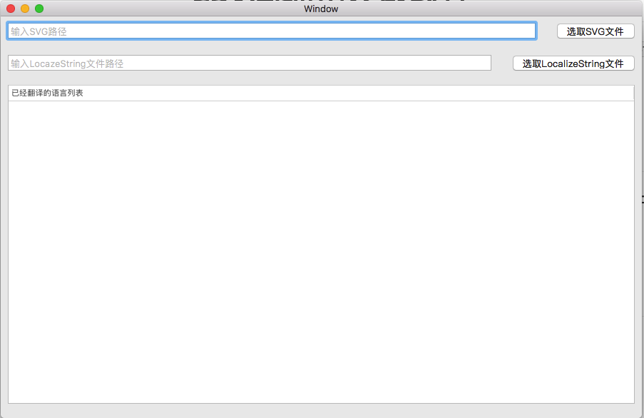
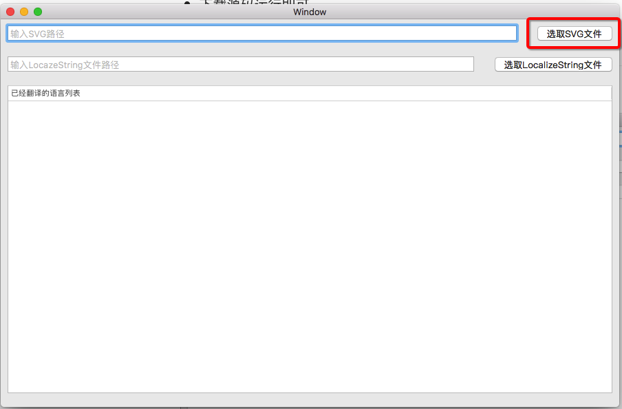
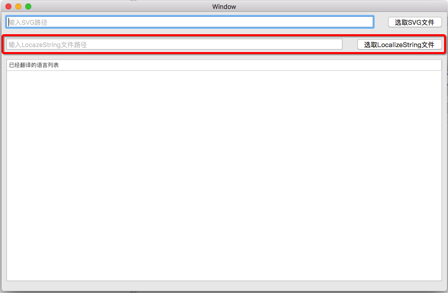
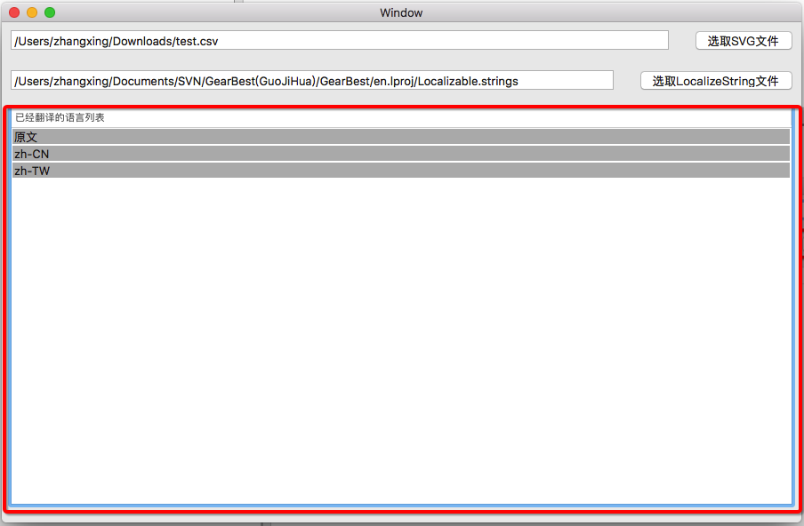
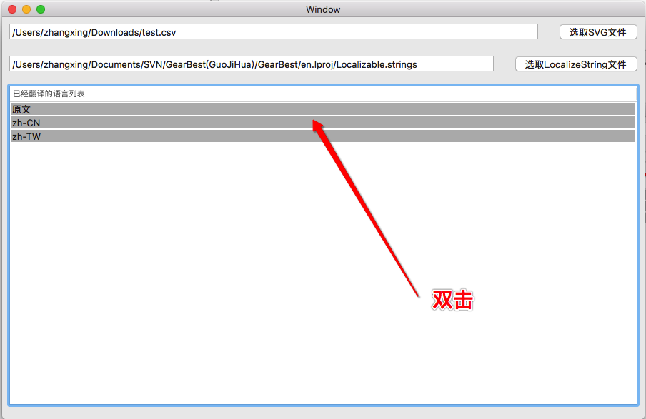
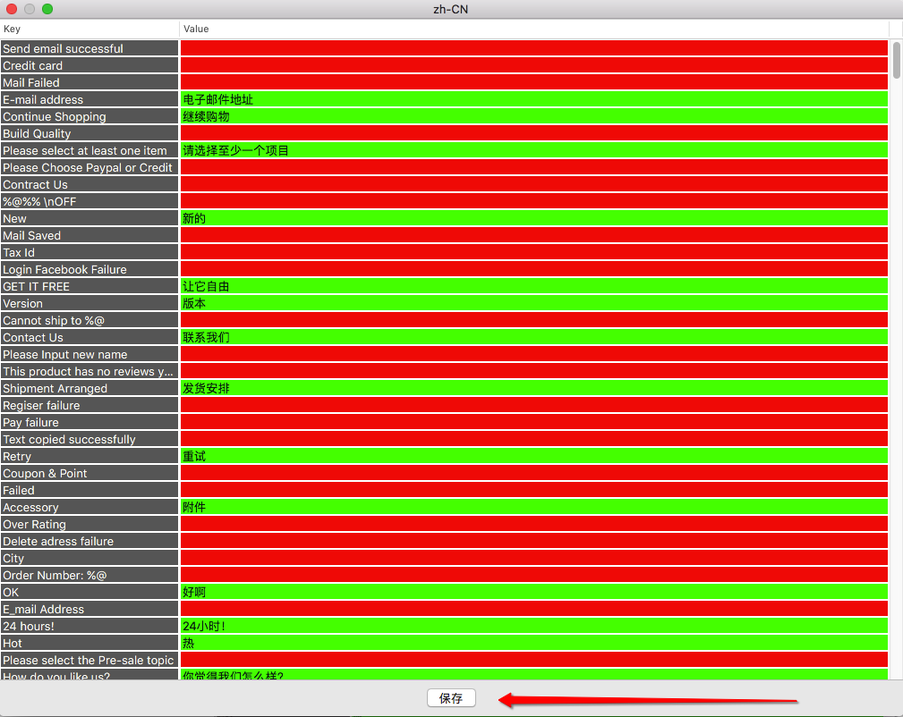
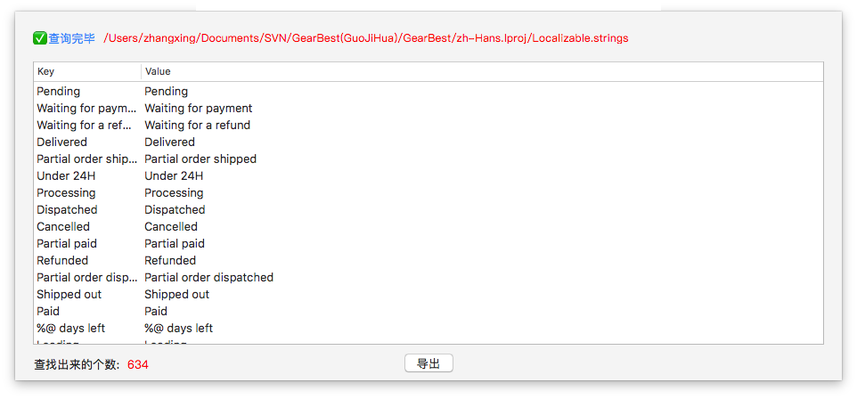
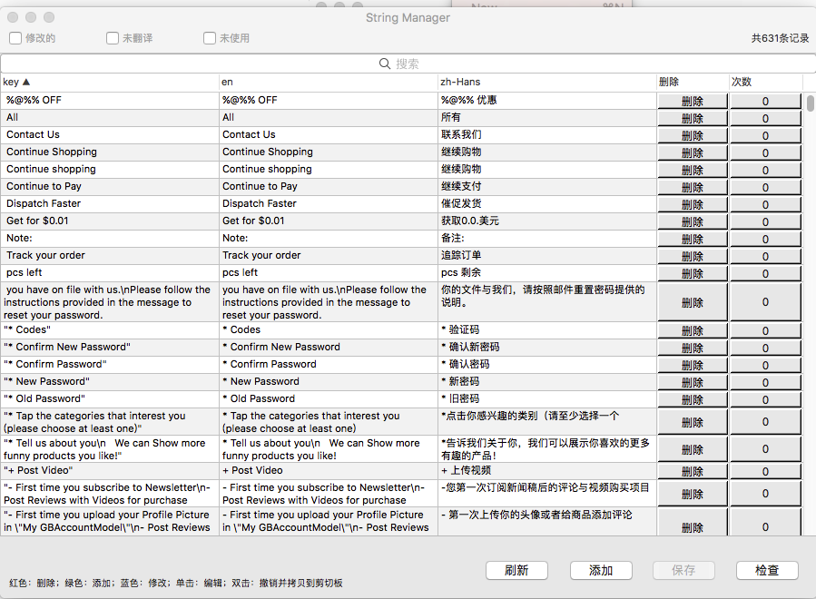

# CSV本地化读取软件

> 如果你觉得不错请Star
>
> 如果你觉得功能有问题可以提问题
>
> 如果你有新想法可以Fork推送

## 未来计划

* 自动提取工程需要国际化文本 难度较大 有实现方法可以提给我 现在只能想到查找设置UILabel UIButton UIViewController标题 等代码处

## 现在支持的功能

* 支持从已经翻译的`CSV`文件读取已经翻译的内容一键保存到指定的`.Strings`文件里面
* 支持查看某种语言未翻译和已翻译部分
* 支持导出还未翻译的字段
* 支持读取源码NSLocalizeString()读取键值保存到原语言包

## 重要说明

* **因为读取CSV系统会自动用`,`分割，如果原生的字段存在 `，`请在导出为CSV文件用 `{R}`占位符替换**
* **导出未翻译部分请全部替换`{R}`为`,`**

## 下载

* 直接下载Mac客户端: [下载](https://github.com/josercc/LocalizedCSV/blob/master/LocalizedCSV/Release/v2.zip?raw=true)
* 下载源码运行即可

## 使用说明

* 主界面

* 读取本地已经存在的`CSV`文件(名字叫做SVG是打错了，懒得改了)

* 读取工程基础语言包

  

* 已经翻译的语言列表

  

  > 一般第一个为基础语言包不需要处理

* 查看已经翻译语言包

  

* 翻译和未翻译 (红色为未翻译，绿色为已经翻译)

  

* 保存到对应的语言路径

  

  > 如果存在还未翻译部分不能保存

* 导出未翻译部分CSV

  

  > 导出的CSV需要全局把`{R}`替换成`,`

* 查询工程使用NSLocalizeString()的字符串 

  

  

  点击保存到指定目录即可。

## 其他支持

* 提取代码里面的国际化可以使用`FauxPas`软件

  

* 查看和编辑国际化语言包可以使用`StringManager`

  https://github.com/Loongwoo/StringManager

  

  ​